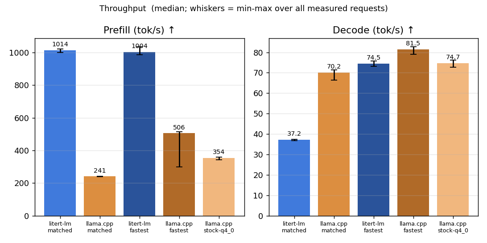
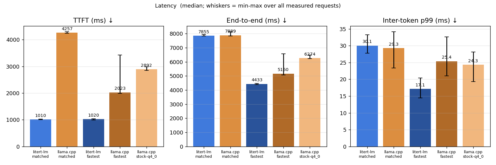
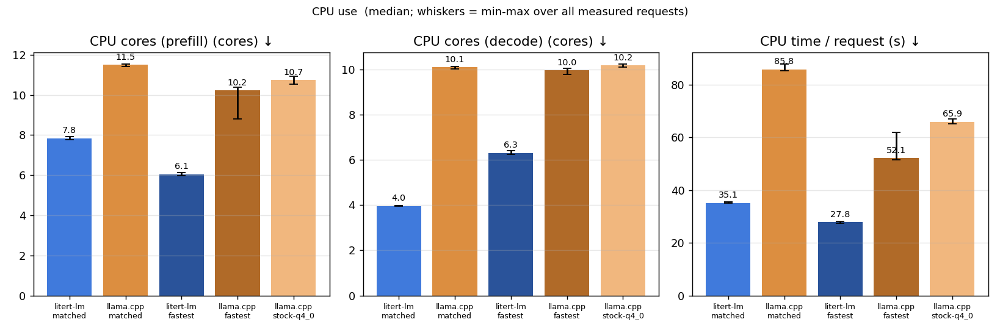
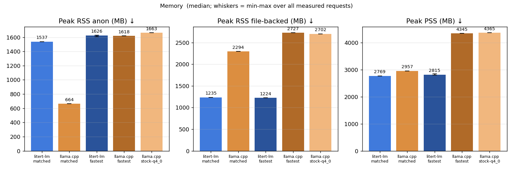
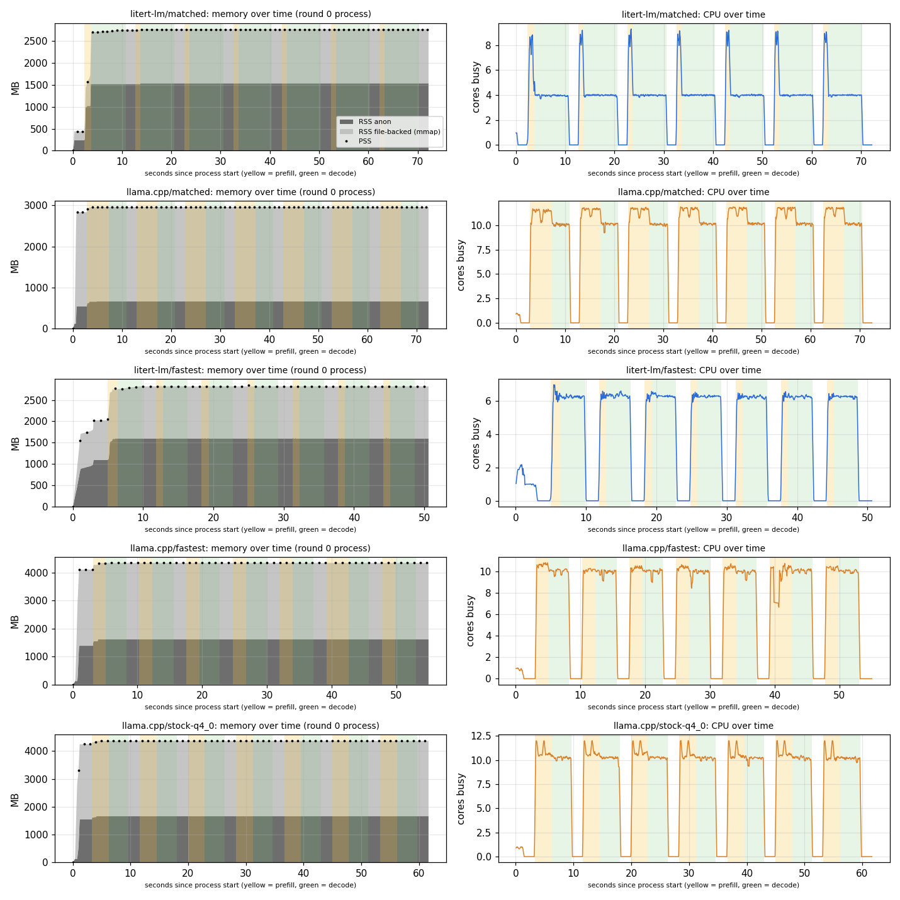
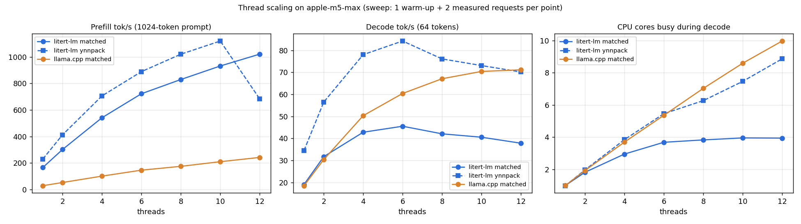
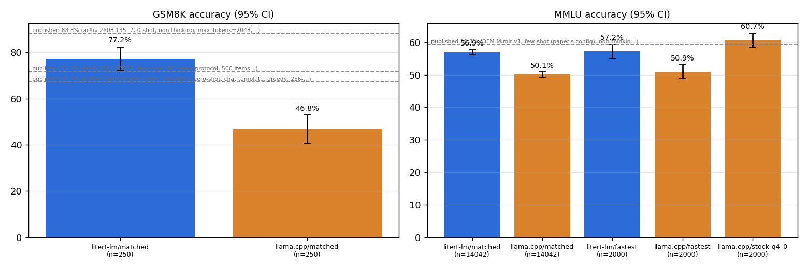
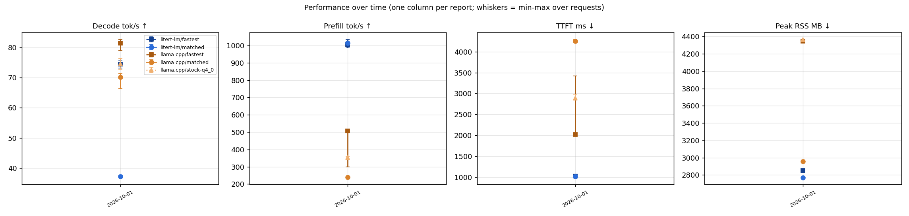

# gemma4-e2b-cpu on apple-m5-max — 2026-10-01

> Generated by `python3 -m aeb.report` from 15 benchmark processes. Raw per-request data: [data.json](data.json). Methodology: [benchmark_methodology.md](../../docs/benchmark_methodology.md).

Gemma 4 E2B on CPU: llama.cpp vs LiteRT-LM. 'matched' = same weights (bit-identical integers), prompt, greedy decode, context, threads and closest KV-cache precision; 'fastest' = each framework's best configuration found by the documented sweep, accuracy-gated; 'reference' = llama.cpp out-of-the-box with the stock ggml-org Q4_0 GGUF.

## Key findings

1. **Same weights, proven.** The `.litertlm` and Google's mobile QAT checkpoint
   hold identical integers and per-channel scales in all 278 quantized text
   tensors. The matched GGUF re-encodes those integers losslessly (INT4→Q4_0,
   INT8→Q8_0, INT2→Q2_K). The only stored difference is fp16 instead of fp32
   per-row scales: ≤0.05% relative error, ≤0.26% for 4 tensors with subnormal
   scales.
2. **Matched track, 12 threads.** The frameworks split the work very
   differently, and end-to-end latency for 1,024 → 256 tokens comes out
   equal (7.86 s vs 7.89 s):
   - LiteRT-LM prefills 4.2× faster: 1,014 vs 241 tok/s, TTFT 1.0 s vs 4.3 s.
   - llama.cpp decodes 1.9× faster: 70.2 vs 37.2 tok/s.
   - llama.cpp burns 2.4× the CPU time: 85.8 vs 35.1 CPU-s per request. Its
     12 worker threads keep ~10 cores busy while decoding; LiteRT-LM's decode
     saturates at ~4 cores.
3. **Fastest track** (each framework tuned, accuracy-gated): LiteRT-LM with
   YNNPACK at 8 threads is the fastest end to end.
   - LiteRT-LM: 4.43 s end to end, 1,004 tok/s prefill, 74.5 tok/s decode,
     27.8 CPU-s, 2.85 GB peak RSS.
   - llama.cpp: 5.16 s end to end, 506 tok/s prefill, 81.5 tok/s decode,
     52.1 CPU-s, 4.35 GB peak RSS. This uses the same integer weights, with
     the INT2 tensors stored as Q4_0 so llama.cpp's repacked Arm kernels
     apply.
   - llama.cpp still decodes ~9% faster; LiteRT-LM prefills 2× faster and
     uses half the CPU time and 1.5 GB less memory.
4. **Accuracy is not equal, even with identical weights.**
   - Full MMLU (14,042 items): LiteRT-LM 56.9% vs llama.cpp 50.1%. On the
     items only one of them answered correctly, McNemar p = 2e-67.
   - GSM8K (250 items): 77.2% vs 46.8%.
   - The same llama.cpp build with the stock ggml-org Q4_0 GGUF, a different
     QAT checkpoint, scores 60.7% on the 2,000-item MMLU subset. So
     llama.cpp's Gemma 4 implementation is not the problem.
   - Cause: the mobile checkpoint was trained with static int8 activation
     rounding (SRQ). LiteRT-LM executes it; llama.cpp cannot express it.
   - The PyTorch reference diagnostic, on 120 items where the frameworks
     disagree, supports this:
     - With SRQ on, the reference matches LiteRT-LM's answer 72% of the time
       and llama.cpp's 23%.
     - With SRQ off, it matches llama.cpp 57% and LiteRT-LM 33%.
     - The reference's own accuracy drops from 53% to 38% when SRQ is
       removed.
     - The match is not perfect: the int8 KV cache and kernel-level
       differences remain.
   - **Practical consequence:** this checkpoint is meant for LiteRT-LM.
     llama.cpp users should use the Q4_0 QAT release, at a different
     memory/speed point (see `llama.cpp/stock-q4_0`).
5. **Reproducibility.**
   - Greedy decoding is bit-identical in every configuration of both
     frameworks, across repeats, processes and thread counts.
   - Seeded sampling is reproducible per request in llama.cpp. In LiteRT-LM
     v0.17.1 it is reproducible only per process: the sampler (and its RNG)
     is created once per engine from the first request's settings. The same
     prompt sampled twice in one process diverges after a median of 10
     tokens, and later requests cannot change the sampling settings.

## Environment

| Item | Value |
| --- | --- |
| Machine | apple-m5-max — Apple M5 Max under a linux/arm64 VM; CPU only, no Metal/ANE |
| Container view | Ubuntu 24.04.5 LTS, kernel Linux 6.8.0-117-generic, 12 vCPUs, 31.3 GiB RAM |
| litert-lm | `v0.17.1` (commit `5e58e9a0aef7`), built 2026-10-01T09:30:54Z |
| llama.cpp | `b11259` (commit `d280808f5d82`), built 2026-10-01T09:30:51Z |
| Harness | digest `4f3a791c1423`, repo rev `a94bf71bcf4b-dirty` |
| Workload | 1024-token real-text chat prompt → 256 greedy tokens (fixed length), context 4096, 2 warm-up + 5 measured requests per process, 3 processes per config interleaved A-B-…/…-B-A |
| Prompt identity | identical token ids in every config (sha256 `ee559b78b98652bf…`) |

## Configurations

| Config | Track | Model file | Driver arguments |
| --- | --- | --- | --- |
| `litert-lm/matched` | matched | `gemma-4-E2B-it.litertlm` (sha256 `181938105e0e`) | `--model <model> --threads 12 --ctx 4096 --cache-dir /results/_cache/litert-lm-xnnpack --fixed-decode-tokens 256` |
| `llama.cpp/matched` | matched | `gemma-4-E2B-it-qat-mobile-matched.gguf` (sha256 `39ba17e470c0`) | `--model <model> --threads 12 --ctx 4096 --flash-attn on --cache-type-k q8_0 --cache-type-v q8_0` |
| `litert-lm/fastest` | fastest | `gemma-4-E2B-it.litertlm` (sha256 `181938105e0e`) | `--model <model> --threads 8 --ctx 4096 --ynnpack --cache-dir /results/_cache/litert-lm-ynnpack --fixed-decode-tokens 256` |
| `llama.cpp/fastest` | fastest | `gemma-4-E2B-it-qat-mobile-matched-q4.gguf` (sha256 `ed8fda86a91a`) | `--model <model> --threads 12 --ctx 4096 --flash-attn on --ubatch 1024` |
| `llama.cpp/stock-q4_0` | reference | `gemma-4-E2B-it-Q4_0.gguf` (sha256 `8e30dff3ac4c`) | `--model <model> --threads 12 --ctx 4096` |

## Quantization equivalence

- `.litertlm` vs `google/gemma-4-E2B-it-qat-mobile-transformers`: **278 quantized tensors compared element by element, all integers and per-channel scales identical** (attention, MLP, per-layer gate/projection for every layer, lm_head, token and per-layer embedding tables).
- `gemma-4-E2B-it-qat-mobile-matched-q4.gguf`: 279 quantized tensors (62× int2→Q4_0, 146× int4→Q4_0, 71× int8→Q8_0); integer round-trip exact for every tensor; per-row scales stored as fp16 (LiteRT: fp32), worst relative scale error 0.26% (only 4 tensors exceed fp16 rounding, from subnormal scales: per_layer_model_proj.weight, blk.0.inp_gate.weight, blk.3.proj.weight, blk.14.inp_gate.weight).
- `gemma-4-E2B-it-qat-mobile-matched.gguf`: 279 quantized tensors (62× int2→Q2_K, 146× int4→Q4_0, 71× int8→Q8_0); integer round-trip exact for every tensor; per-row scales stored as fp16 (LiteRT: fp32), worst relative scale error 0.26% (only 4 tensors exceed fp16 rounding, from subnormal scales: per_layer_model_proj.weight, blk.0.inp_gate.weight, blk.3.proj.weight, blk.14.inp_gate.weight).

| Tensor group | Checkpoint / LiteRT-LM | Matched GGUF | `-q4` GGUF | Stock ggml-org Q4_0 |
| --- | --- | --- | --- | --- |
| Token embedding, lm_head | INT2 per-row (separate lm_head) | Q2_K, d = dmin = s | Q4_0, d = s | Q8_0 (tied) |
| Attention q/k/v/o | INT4 per-channel | Q4_0, d = s | Q4_0, d = s | Q4_0 (block-32 scales) |
| MLP layers 0-14 | INT4 per-channel | Q4_0, d = s | Q4_0, d = s | Q4_0 |
| MLP layers 15-34 (double-wide) | INT2 per-channel | Q2_K | Q4_0 | Q4_0 |
| Per-layer embeddings | INT4 per (token, layer) | Q4_0 | Q4_0 | Q4_0 |
| Per-layer gate / projection | INT8 per-channel | Q8_0 | Q8_0 | Q4_0 |
| Per-layer model projection | INT8 per-channel (LiteRT PTQ) | Q8_0 (same ints) | Q8_0 | BF16 |
| Norms, layer scalars | BF16 values (fp32 tensors in LiteRT) | F32, same values | F32, same values | F32 (different QAT checkpoint) |
| Activations | static per-tensor INT8 (QAT scales) | dynamic Q8_0/Q8_K per block | same | same |
| KV cache | INT8, static per-tensor scale | Q8_0 (matched track) | F16 (fastest) | F16 |

## Results

Medians over all measured requests (n per cell in the last row); [min – max] in brackets.

| Metric | `litert-lm/matched` | `llama.cpp/matched` | `litert-lm/fastest` | `llama.cpp/fastest` | `llama.cpp/stock-q4_0` |
| --- | --- | --- | --- | --- | --- |
| TTFT (ms) ↓ | 1010 [1002–1025] | 4257 [4239–4294] | 1020 [990–1038] | 2023 [1989–3422] | 2892 [2852–2987] |
| Prefill (tok/s) ↑ | 1014.0 [999.1–1021.7] | 240.5 [238.5–241.6] | 1003.5 [986.2–1034.7] | 506.2 [299.2–514.9] | 354.1 [342.8–359.1] |
| Decode (tok/s) ↑ | 37.23 [36.85–37.41] | 70.18 [66.41–71.41] | 74.49 [73.17–75.78] | 81.50 [78.96–82.68] | 74.69 [72.81–76.28] |
| End-to-end (ms) ↓ | 7855 [7830–7940] | 7889 [7845–8134] | 4433 [4388–4481] | 5160 [5073–6581] | 6274 [6224–6485] |
| Inter-token p99 (ms) ↓ | 30.1 [27.8–33.2] | 29.3 [23.4–34.2] | 17.1 [14.5–20.4] | 25.4 [21.0–32.7] | 24.3 [19.3–28.2] |
| CPU cores (prefill) (cores) ↓ | 7.85 [7.76–7.91] | 11.51 [11.43–11.53] | 6.05 [5.97–6.12] | 10.23 [8.81–10.38] | 10.75 [10.54–10.93] |
| CPU cores (decode) (cores) ↓ | 3.96 [3.95–3.99] | 10.10 [10.02–10.14] | 6.30 [6.23–6.41] | 9.96 [9.78–10.04] | 10.17 [10.11–10.23] |
| CPU time / request (s) ↓ | 35.1 [35.0–35.5] | 85.8 [85.1–87.8] | 27.8 [27.4–28.2] | 52.1 [51.4–62.0] | 65.9 [65.1–67.0] |
| Peak RSS (request) (MB) ↓ | 2772 [2772–2772] | 2957 [2957–2957] | 2850 [2830–2851] | 4345 [4345–4345] | 4365 [4365–4365] |
| Peak RSS anon (MB) ↓ | 1537 [1537–1537] | 664 [664–664] | 1626 [1605–1627] | 1618 [1618–1618] | 1663 [1663–1663] |
| Peak RSS file-backed (MB) ↓ | 1235 [1235–1235] | 2294 [2294–2294] | 1224 [1224–1224] | 2727 [2727–2727] | 2702 [2702–2702] |
| Peak PSS (MB) ↓ | 2769 [2769–2769] | 2957 [2957–2957] | 2815 [2799–2848] | 4345 [4345–4345] | 4365 [4365–4365] |
| Model load, warm cache (ms) | 223 | 761 | 2892 | 980 | 1101 |
| Peak RSS, process lifetime (VmHWM, MB) | 2772 | 2957 | 2850 | 4345 | 4365 |
| RSS after load, before 1st request (MB) | 440 | 2833 | 2022 | 4110 | 4244 |
|   …of which anonymous (MB) | 236 | 540 | 1091 | 1384 | 1543 |
| Container memory.peak incl. page cache (MB) | 2926 | 2990 | 2970 | 4382 | 4401 |
| Measured requests (n) | 15 | 15 | 15 | 15 | 15 |
| Decode CV across requests | 0.4% | 1.6% | 1.0% | 1.5% | 1.3% |

### llama.cpp ÷ LiteRT-LM

Ratio of medians with a 95% bootstrap interval over requests. >1 means llama.cpp has the larger value (better for throughput, worse for latency/CPU/memory).

| Track | Prefill tok/s | Decode tok/s | TTFT | End-to-end | CPU s / request | Peak RSS |
| --- | --- | --- | --- | --- | --- | --- |
| matched | 0.24× [0.24, 0.24] | 1.88× [1.87, 1.89] | 4.22× [4.18, 4.23] | 1.00× [1.00, 1.01] | 2.44× [2.43, 2.45] | 1.07× [1.07, 1.07] |
| fastest | 0.50× [0.49, 0.51] | 1.09× [1.08, 1.10] | 1.98× [1.96, 2.05] | 1.16× [1.15, 1.18] | 1.87× [1.86, 1.89] | 1.52× [1.52, 1.53] |

### Memory and CPU over time

One process per configuration (round 0): load, warm-up and measured requests. Yellow = prefill, green = decode. File-backed RSS is mmap'd model pages (shared, reclaimable); anonymous RSS is private memory (KV cache, activations, repacked or converted weights).

### Thread scaling

### Generated text on the timing prompt

Greedy decoding should be deterministic within a configuration. Different configurations may legitimately diverge (different activation/KV quantization and kernels change near-tie logits); the accuracy gate below is the validity check.

| Config | Identical across all measured requests | First 140 characters |
| --- | --- | --- |
| `litert-lm/matched` | yes | ## CHAPTER II. ⏎ The well continued its descent, the darkness growing heavier, the silence of the depths pressing in on Alice until it felt li |
| `llama.cpp/matched` | yes | Here is a continuation of the story, continuing the style and tone of the provided excerpt: ⏎  ⏎ *** ⏎  ⏎ Alice’s voice, though slightly breathless, |
| `litert-lm/fastest` | yes | ## Chapter II. The Curious World Below ⏎  ⏎ Alice continued her descent, the darkness of the well a thick, suffocating blanket that pressed in o |
| `llama.cpp/fastest` | yes | This is a fascinating excerpt, rich in atmosphere and a sense of whimsical, slightly surreal adventure. The style is reminiscent of early 20 |
| `llama.cpp/stock-q4_0` | yes | CHAPTER II. ⏎ The Descent into the Unknown ⏎  ⏎ “And what an ignorant little girl she,” Alice continued, her voice echoing strangely in the vast,  |

## Accuracy (validity gate)

Same prompts, greedy decoding, through the same in-process drivers as the timing runs. Use these to confirm each configuration produces correct tokens, and to compare frameworks on identical items; they are not leaderboard numbers.

| Config | Task | Items | Accuracy | 95% CI | Macro (MMLU) | Parse failures | Mean generated tokens | Hit token limit |
| --- | --- | --- | --- | --- | --- | --- | --- | --- |
| `litert-lm/matched` | mmlu | 14042 (full test set) | 56.92% | ±0.82% | 58.32% | 47 | 5.9 | n/a (letter only) |
| `llama.cpp/matched` | mmlu | 14042 (full test set) | 50.09% | ±0.83% | 51.43% | 61 | 8.0 | n/a (letter only) |
| `litert-lm/fastest` | mmlu | 2000 (stratified subset) | 57.20% | ±2.17% | 57.21% | 7 | 6.8 | n/a (letter only) |
| `llama.cpp/fastest` | mmlu | 2000 (stratified subset) | 50.95% | ±2.19% | 50.96% | 5 | 8.0 | n/a (letter only) |
| `llama.cpp/stock-q4_0` | mmlu | 2000 (stratified subset) | 60.65% | ±2.14% | 60.67% | 33 | 6.7 | n/a (letter only) |
| `litert-lm/matched` | gsm8k | 250 (evenly spaced subset) | 77.20% | ±5.20% | n/a | 0 | 381.2 | 55 (cap 512) |
| `llama.cpp/matched` | gsm8k | 250 (evenly spaced subset) | 46.80% | ±6.19% | n/a | 0 | 377.7 | 83 (cap 512) |

**Paired comparison on identical items.** Same prediction = both configs chose the same answer; McNemar's exact test on items only one config got right (p < 0.05 means a real accuracy difference).

| Task | A | B | Items | Same prediction | Acc A | Acc B | Only A right | Only B right | McNemar p |
| --- | --- | --- | --- | --- | --- | --- | --- | --- | --- |
| mmlu | `litert-lm/matched` | `llama.cpp/matched` | 14042 | 67.2% | 56.92% | 50.09% | 2033 | 1073 | 2.02e-67 |
| mmlu | `litert-lm/fastest` | `litert-lm/matched` | 2000 | 88.5% | 57.20% | 57.45% | 75 | 80 | 0.748 |
| mmlu | `litert-lm/fastest` | `llama.cpp/fastest` | 2000 | 68.8% | 57.20% | 50.95% | 273 | 148 | 1.15e-09 |
| mmlu | `llama.cpp/fastest` | `llama.cpp/matched` | 2000 | 98.5% | 50.95% | 50.90% | 10 | 9 | 1 |
| mmlu | `llama.cpp/fastest` | `llama.cpp/stock-q4_0` | 2000 | 63.1% | 50.95% | 60.65% | 161 | 355 | 8.02e-18 |
| mmlu | `llama.cpp/matched` | `llama.cpp/stock-q4_0` | 2000 | 63.4% | 50.90% | 60.65% | 159 | 354 | 4.26e-18 |
| gsm8k | `litert-lm/matched` | `llama.cpp/matched` | 250 | 47.2% | 77.20% | 46.80% | 82 | 6 | 3.77e-18 |

### Diagnostic: why do identical weights score differently?

The upstream PyTorch reference of the same checkpoint (transformers `gemma` quantizer, weights dequantized to fp32) re-answered MMLU items with its static int8 activation rounding (SRQ) **on** — as trained, and as LiteRT-LM runs it — and **off** (full-precision activations, what llama.cpp approximates). A = `llama.cpp/matched`, B = `litert-lm/matched`. Produced by `python3 -m aeb.prep.hf_reference`.

| Items | n | Reference SRQ on: accuracy / agrees with A / agrees with B | Reference SRQ off: accuracy / agrees with A / agrees with B | A accuracy | B accuracy |
| --- | --- | --- | --- | --- | --- |
| discordant (A and B disagree on correctness) | 120 | 53% / 22% / 72% | 38% / 57% / 32% | 32% | 68% |
| concordant (A and B both right or both wrong) | 40 | 57% / 75% / 85% | 60% / 75% / 72% | 48% | 48% |

### Publicly reported accuracy

Google publishes no original-MMLU or GSM8K score for Gemma 4 E2B (model card, QAT cards and tech report checked); its static benchmarks are reported in thinking mode on bf16 weights, and the QAT cards only claim quality similar to bf16. The MMLU and GSM8K references below are third-party bf16 evaluations with their own prompts. None of these setups matches this harness (zero-shot, non-thinking, greedy, quantized weights, answer-prefilled MMLU), so use them as an order-of-magnitude sanity check, not as a pass/fail threshold; the frameworks are judged against each other on identical items.

| Benchmark | Published | Model variant | Setup | Source | Measured here (non-thinking, greedy) |
| --- | --- | --- | --- | --- | --- |
| MMLU | 59.3% | E2B, bf16 | few-shot (paper's config), non-thinking, MCQ with max_tokens=1, temperature 0 | [DFM Mimir v1, arXiv 2608.13517, Table 7](https://arxiv.org/abs/2608.13517) | `litert-lm/matched` 56.9% (n=14042); `llama.cpp/matched` 50.1% (n=14042) |
| MMLU | 72.0% | E2B, bf16 | same, thinking on | [arXiv 2608.13517, Table 7](https://arxiv.org/abs/2608.13517) | — |
| GSM8K | 88.3% | E2B, bf16 | 0-shot, non-thinking, max_tokens=2048, temperature 0, full test set | [arXiv 2608.13517, Table 8](https://arxiv.org/abs/2608.13517) | `litert-lm/matched` 77.2% (n=250); `llama.cpp/matched` 46.8% (n=250) |
| GSM8K | 90.3% | E2B, bf16 | same, thinking on | [arXiv 2608.13517, Table 8](https://arxiv.org/abs/2608.13517) | — |
| GSM8K | 67.4% | gemma-4-E2B-it, bf16 | zero-shot, chat template, greedy, 256-token cap, 500-item subset (95% CI 63.2-71.4) | [Unified Deployment-Aware Evaluation, arXiv 2604.07035](https://arxiv.org/abs/2604.07035) | — |
| GSM8K | 71.8% | gemma-4-E2B-it, bf16 | few-shot CoT, same protocol, 500 items (95% CI 67.7-75.6) | [arXiv 2604.07035](https://arxiv.org/abs/2604.07035) | — |
| MMLU-Pro | 60.0% | gemma-4-E2B-it, bf16 | thinking mode (Google) | [Gemma 4 model card / tech report Table 5](https://huggingface.co/google/gemma-4-E2B-it) | — |
| MMMLU | 67.4% | gemma-4-E2B-it, bf16 | thinking mode (Google) | [Gemma 4 model card / tech report Table 5](https://huggingface.co/google/gemma-4-E2B-it) | — |
| IFEval | 94.6% | gemma-4-E2B-it, bf16 | thinking mode (Google) | [Gemma 4 tech report, arXiv 2607.02770, Table 5](https://arxiv.org/abs/2607.02770) | — |
| GPQA Diamond | 43.4% | gemma-4-E2B-it, bf16 | thinking mode (Google) | [Gemma 4 model card](https://huggingface.co/google/gemma-4-E2B-it) | — |
| BigBench Extra Hard | 21.9% | gemma-4-E2B-it, bf16 | thinking mode (Google) | [Gemma 4 model card](https://huggingface.co/google/gemma-4-E2B-it) | — |
| AIME 2026 (no tools) | 37.5% | gemma-4-E2B-it, bf16 | thinking mode (Google) | [Gemma 4 model card](https://huggingface.co/google/gemma-4-E2B-it) | — |
| LiveCodeBench v6 | 44.0% | gemma-4-E2B-it, bf16 | thinking mode (Google) | [Gemma 4 model card](https://huggingface.co/google/gemma-4-E2B-it) | — |
| MMLU (predecessor Gemma 3n E2B-it) | 60.1% | gemma-3n-E2B-it | 0-shot (Google) | [Gemma 3n E2B model card](https://huggingface.co/google/gemma-3n-E2B-it) | — |

- Published Gemma 4 scores use bf16 weights; no source reports accuracy for the mobile-QAT (.litertlm) or Q4_0 checkpoints themselves.
- The two third-party GSM8K numbers differ by ~20 points (88.3 vs 67.4) because of the token cap (2048 vs 256) and prompt; this harness uses a 512-token cap, so it should land between them if the quantized model is healthy.
- Google's Table 5 states all models are in thinking mode unless noted; this harness runs with thinking disabled, which costs several points on reasoning-heavy sets (e.g. MMLU 59.3 -> 72.0 with thinking in arXiv 2608.13517).

## Output reproducibility

Same model file, build, prompt and settings, repeated: 12 prompts × 3 repeats per process, fresh KV cache per request, stop tokens honoured, ≤128 tokens. *Within process* = repeats vs. the first repeat; *across processes* = a second fresh process with the same request sequence; *across threads* = a process with half the threads. Seeded = temperature 1.0, top-k 64, top-p 0.95, fixed seed; the *seed control* reruns with seed+1 and must change outputs, otherwise seeded reproducibility would be vacuous. Method: [benchmark_methodology.md](../../docs/benchmark_methodology.md#output-reproducibility).

| Config | Mode | Verdict | Within process | Across processes | Across threads | Seed control |
| --- | --- | --- | --- | --- | --- | --- |
| `litert-lm/matched` | greedy | **reproducible per request** | 72/72 identical | 36/36 identical | 36/36 identical (12→6 threads) | — |
| `litert-lm/matched` | seeded | **reproducible per process only** (state carries across requests) | 12/72 identical; first divergence at token 10 (median) | 36/36 identical | 36/36 identical (12→6 threads) | 30/36 outputs changed |
| `llama.cpp/matched` | greedy | **reproducible per request** | 72/72 identical | 36/36 identical | 36/36 identical (12→6 threads) | — |
| `llama.cpp/matched` | seeded | **reproducible per request** | 72/72 identical | 36/36 identical | 36/36 identical (12→6 threads) | 33/36 outputs changed |
| `litert-lm/fastest` | greedy | **reproducible per request** | 72/72 identical | 36/36 identical | 36/36 identical (8→4 threads) | — |
| `litert-lm/fastest` | seeded | **reproducible per process only** (state carries across requests) | 12/72 identical; first divergence at token 10 (median) | 36/36 identical | 36/36 identical (8→4 threads) | 30/36 outputs changed |
| `llama.cpp/fastest` | greedy | **reproducible per request** | 72/72 identical | 36/36 identical | 36/36 identical (12→6 threads) | — |
| `llama.cpp/fastest` | seeded | **reproducible per request** | 72/72 identical | 36/36 identical | 36/36 identical (12→6 threads) | 33/36 outputs changed |
| `llama.cpp/stock-q4_0` | greedy | **reproducible per request** | 72/72 identical | 36/36 identical | 36/36 identical (12→6 threads) | — |
| `llama.cpp/stock-q4_0` | seeded | **reproducible per request** | 72/72 identical | 36/36 identical | 36/36 identical (12→6 threads) | 30/36 outputs changed |

Cross-framework (informational, greedy): `llama.cpp/matched` and `litert-lm/matched` produce identical text for 6/36 prompt-repeats, median first divergence at token 6. Identical weights do not imply identical outputs when activation/KV quantization and kernels differ.

## Performance over time

Every report appends one line per configuration to [`history/gemma4-e2b-cpu/apple-m5-max.jsonl`](../history/gemma4-e2b-cpu/apple-m5-max.jsonl) (medians, ranges, framework commits, harness digest, model hashes). A change is flagged when the median moves by more than max(3%, 3 × the larger coefficient of variation) between consecutive reports of the same config.

| Date | Config | Framework commit | Decode tok/s | Prefill tok/s | TTFT ms | Peak RSS MB | MMLU |
| --- | --- | --- | --- | --- | --- | --- | --- |
| 2026-10-01 | `litert-lm/fastest` | `5e58e9a0ae` | 74.49 | 1003.5 | 1020 | 2850 | 57.20% |
| 2026-10-01 | `litert-lm/matched` | `5e58e9a0ae` | 37.23 | 1014.0 | 1010 | 2772 | 56.92% |
| 2026-10-01 | `llama.cpp/fastest` | `d280808f5d` | 81.50 | 506.2 | 2023 | 4345 | 50.95% |
| 2026-10-01 | `llama.cpp/matched` | `d280808f5d` | 70.18 | 240.5 | 4257 | 2957 | 50.09% |
| 2026-10-01 | `llama.cpp/stock-q4_0` | `d280808f5d` | 74.69 | 354.1 | 2892 | 4365 | 60.65% |

**Flagged changes vs. previous report:** none (first report, or all within noise).

## Data-quality checks

- `llama.cpp/matched` run `20261001T093405Z-97a04d`: end-to-end outlier request indices [0] (MAD rule) — kept, not discarded.
- `llama.cpp/fastest` run `20261001T093651Z-ae81af`: end-to-end outlier request indices [3] (MAD rule) — kept, not discarded.

## Caveats

**Environment**
- **Virtualized host.** Colima Linux VM with 12 vCPUs and 31 GiB on an
  18-core Apple M5 Max (6 + 12 cores by `hw.perflevel`). macOS schedules the
  vCPUs; frequency, pinning and SMT cannot be controlled from inside the VM.
  Metal and the Neural Engine are unreachable. These numbers are not
  comparable with native macOS runs or with the LiteRT-LM model card's macOS
  CPU figures, which use 4 threads and a 2,048-token context.
- **Host sleep during one timing process.** macOS slept from 11:37:29 to
  11:44:14 (local time; `pmset -g log`) during round 0 of
  `llama.cpp/fastest`. The VM's monotonic clock stops while asleep, so it
  shows up only as one slow request (TTFT 3.4 s vs ~2.0 s). The outlier
  check flags it, and the medians are unaffected. The suite runner now holds
  a `caffeinate` assertion.

**Numerics**
- **Identical weights ≠ identical numerics.** LiteRT-LM applies the
  checkpoint's static per-tensor int8 activation quantization and an int8 KV
  cache with fixed scales. llama.cpp quantizes activations dynamically per
  32/256-element block and uses a Q8_0 KV cache in the matched track (f16 in
  fastest/reference). Greedy outputs of the two frameworks diverge after a
  median of 6 tokens on the reproducibility prompts, and from the first
  token on the 1,024-token timing prompt.
- **Kernel coverage drives the llama.cpp prefill result.** llama.cpp has no
  repacked/i8mm path for Q2_K on Arm. The INT2 layers (the double-wide MLPs
  of layers 15–34, most of the compute) therefore run slowly in the
  storage-matched GGUF. Storing the same values as Q4_0 doubles llama.cpp
  prefill but adds 1.4 GB of peak RSS: +0.95 GB of anonymous repacked
  weights, and a larger file (2.7 GB vs 2.3 GB).

**Threads and CPU use**
- **Thread count changes the ratio.** The matched headline uses all 12
  vCPUs, per the protocol. LiteRT-LM XNNPACK decode peaks at 6 threads
  (45.5 tok/s) and drops to 37 tok/s at 12, while llama.cpp keeps improving
  to 12 threads. At 4 threads the decode ratio is 1.2×, not 1.9× (thread
  scaling chart). Do not quote one ratio without the thread count.
- **CPU time includes busy-waiting.** llama.cpp's thread pool polls between
  operations, which is a real cost on a shared device. Its polling level was
  left at the default.

**Memory**
- RSS includes mmap'd model pages (file-backed, shared, reclaimable).
- LiteRT-LM touches its weights lazily: RSS is 0.44 GB after load and
  2.7 GB after the first request.
- llama.cpp with Q4_0 repacking holds both the mmap'd original and an
  anonymous repacked copy.
- Container `memory.peak` also counts page cache.

**Caches and load time**
- XNNPACK weight caches were primed before measuring.
- YNNPACK writes no weight cache and repacks on every load (2.9 s vs 0.2 s).
- Cold start was not measured.

**Workload definition**
- **Prefill length is a sweet spot for LiteRT-LM.** The `.litertlm` ships
  fixed prefill signatures (128 and 1,024 tokens). The 1,024-token workload
  matches one exactly; other prompt lengths are chunked and padded, and may
  look less favourable.
- **Fixed-length decode.** Both frameworks decode exactly 256 tokens with
  stop tokens ignored: LiteRT-LM through its engine benchmark parameter,
  llama.cpp by not stopping. LiteRT-LM token counts come from its
  BenchmarkInfo; one streamed chunk per token was observed.
- **Greedy in LiteRT-LM** is the TOP_P sampler with `top_k = 1`; its GREEDY
  and TOP_K samplers are unimplemented on CPU at v0.17.1.

**Accuracy setup**
- **MMLU** is generative and zero-shot, with thinking disabled and the model
  turn pre-filled with "The answer is". It is a validity gate, not a
  leaderboard score; Google does not publish MMLU or GSM8K for Gemma 4 E2B.
- **GSM8K** used a 512-token cap; 83 (llama.cpp) and 55 (LiteRT-LM) of 250
  answers hit it. On answers that did not hit the cap: 67% vs 96%. A
  1,024–2,048-token cap is recommended for future runs.
- **Thread count during accuracy.** Accuracy ran two processes side by side
  at 6 threads each. Outputs were verified bit-identical to 12-thread runs
  on 65 items per framework, and the reproducibility suite confirms thread
  invariance.

**Fastest configuration selection**
- The fastest configs were picked on this machine from short sweeps (2
  measured requests per point), minimising median end-to-end latency for this
  workload. A different objective or prompt length could pick differently.

**Native-tool cross-check (agreement within ~5%)**

| | Native tool | Harness |
| --- | --- | --- |
| llama.cpp prefill, 1,024 tokens (tok/s) | 229.7 (`llama-bench`) | 240.5 |
| llama.cpp decode at depth 0 (tok/s) | 88.7 | — |
| llama.cpp decode at depth 1,024 (tok/s) | 74.3 | 70.2 |
| LiteRT-LM prefill (tok/s) | 1,099 (`litert_lm_advanced_main`, zero-padded prompt) | 1,014 |
| LiteRT-LM decode (tok/s) | 37.5 | 37.2 |
| LiteRT-LM TTFT (s) | 0.96 | 1.01 |

The harness's llama.cpp decode also includes greedy arg-max over the
262k-entry vocabulary each step. Run directories:
`results/apple-m5-max/{llama.cpp/native-matched-d*,litert-lm/native-matched}/`.

**Native tool fix**
- `litert_lm_main` at v0.17.1 ignores `--benchmark_prefill_tokens` and
  `--benchmark_decode_tokens`. The native bench script now uses
  `litert_lm_advanced_main` with `--max_num_tokens`.

**History**
- This is the first report, so the history has one point per configuration.
  Trend detection starts with the next run.
