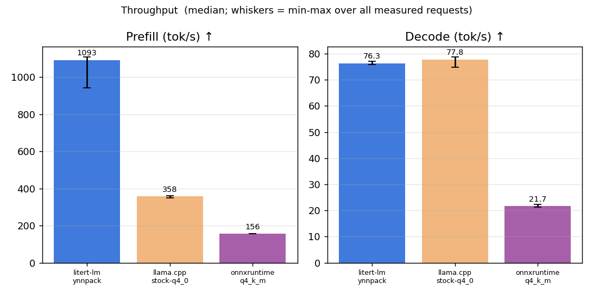
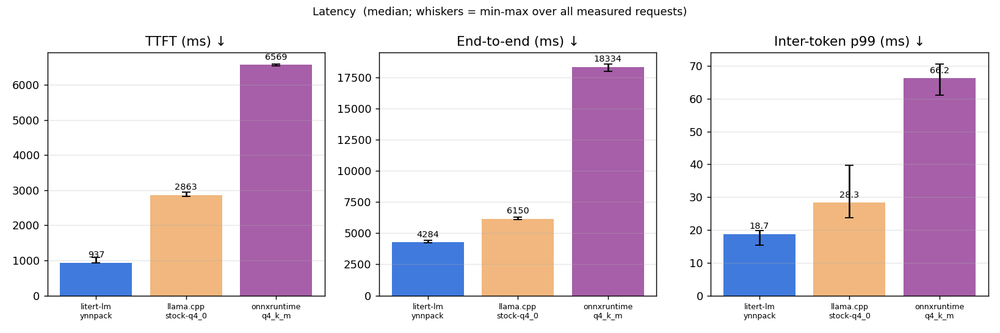
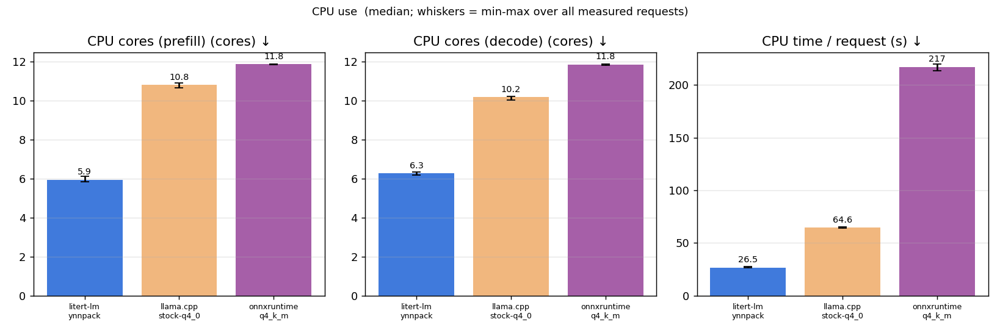
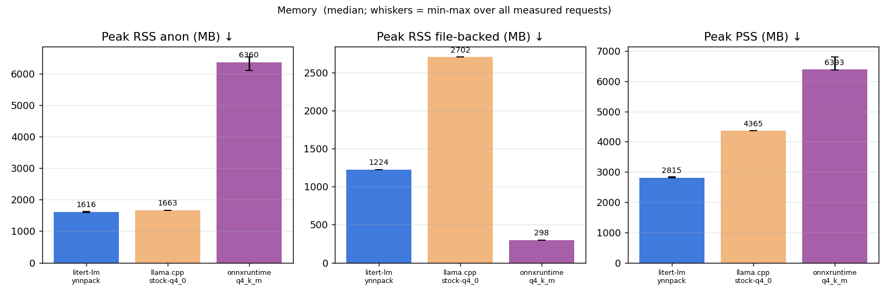
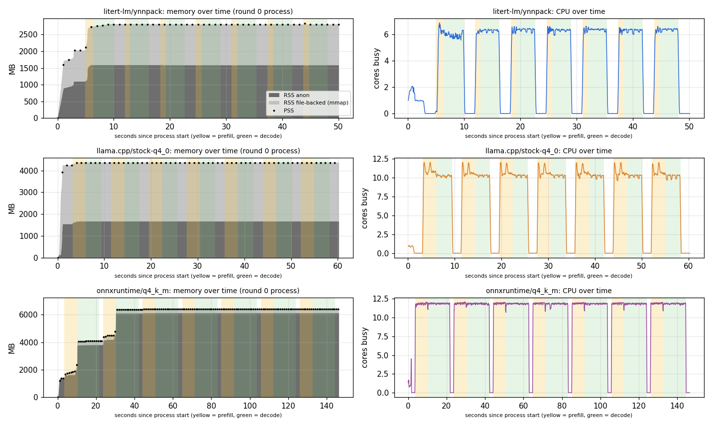
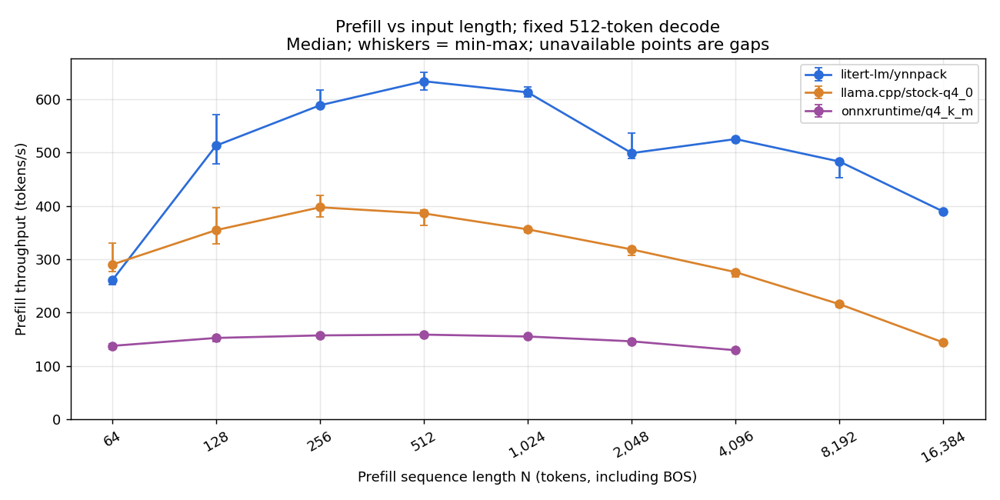
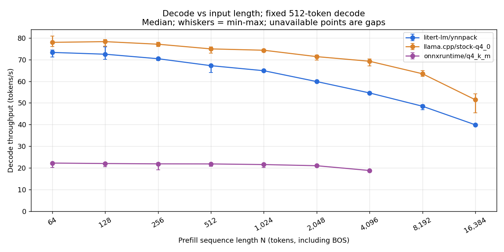
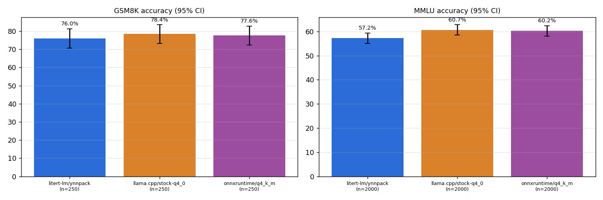
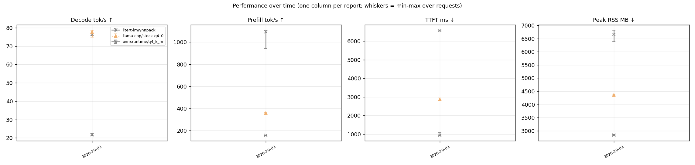

# gemma4-e2b-cpu-arm-runtimes on apple-m5-max — 2026-10-02

> Generated by `python3 -m aeb.report` from 9 headline benchmark processes plus 81 input-length sweep processes. Raw per-request data: [data.json](data.json). Methodology: [benchmark_methodology.md](../../docs/benchmark_methodology.md).

Exploratory Gemma 4 E2B CPU comparison on the Apple M5 Max Linux/ARM VM. All configurations use independently published artifacts and are open/reference comparisons, NOT matched weights or quantization. Validate each model with the accuracy gate before interpreting speed; consult docs/harness.md for staging and limitations.

## Key findings

1. **LiteRT-LM + YNNPACK has the lowest end-to-end latency among the
   three tested configurations:** 4.28 s for
   1,024 -> 256 tokens, versus 6.15 s for stock llama.cpp Q4_0 and 18.33 s for
   ONNX Runtime GenAI Q4_K_M. These are independently quantized reference
   configurations, not a matched-weight comparison or an exhaustive tuning
   result.
2. **llama.cpp decodes slightly faster; LiteRT-LM prefills much faster.**
   Decode is 77.75 versus 76.29 tok/s. Prefill is 357.7 versus 1,092.9 tok/s.
   ONNX Runtime reaches 155.9 tok/s prefill and 21.66 tok/s decode.
3. **ONNX Runtime's accuracy is close to stock llama.cpp on these subsets.**
   MMLU: 60.25% versus 60.65%; GSM8K: 77.60% versus 78.40%.
   LiteRT-LM scores 57.20% and 76.00%. Inspect the confidence intervals and
   differing model artifacts; this does not establish numerical equivalence.
4. **Resource use differs substantially.** Median peak request RSS is
   2,839 MB for LiteRT-LM, 4,365 MB for llama.cpp and 6,658 MB for ONNX Runtime.
   CPU time per request is 26.5, 64.6 and 217.1 CPU-seconds respectively.
5. **Headline completion and reproducibility:** all nine headline timing processes completed,
   giving 15 measured requests per configuration; all six accuracy jobs
   completed (2,000 MMLU and 250 GSM8K items each). Greedy outputs are
   reproducible across repeats, processes and tested thread counts. ONNX
   Runtime and llama.cpp seeded sampling is reproducible per request;
   LiteRT-LM remains reproducible per process only.
6. **Input-length sweep (512-token decode):** llama.cpp decodes faster at
   every tested N; LiteRT-LM prefills faster from N = 128 through 16,384.
   At N = 16,384, LiteRT-LM versus llama.cpp reaches 389.4 versus 144.1
   tokens/s prefill and 39.91 versus 51.46 tokens/s decode.
   The sweep collected 375 measured requests from 75 successful processes.
   ONNX Runtime completed through N = 4,096, but **ran out of memory at
   N = 8,192 and 16,384 in all three attempts each**. These points are
   unavailable, not zero throughput or extrapolations; the configurations
   were kept unchanged.

## Environment

| Item | Value |
| --- | --- |
| Machine | apple-m5-max — Apple M5 Max under a linux/arm64 VM; CPU only, no Metal/ANE |
| Container view | Ubuntu 24.04.5 LTS, kernel Linux 6.8.0-117-generic, 12 vCPUs, 31.3 GiB RAM |
| litert-lm | `v0.17.1`, commit `5e58e9a0aef7`, built 2026-10-01T13:43:57Z |
| llama.cpp | `b11259`, commit `d280808f5d82`, built 2026-10-02T08:42:26Z |
| onnxruntime | `onnxruntime-genai==0.17.1`, built 2026-10-02T08:34:37Z |
| Harness | digest `63d0862b3a4c`, repo rev `fe5a70c17b54-dirty` |
| Workload | 1024-token real-text chat prompt → 256 greedy tokens (fixed length), context 4096, 2 warm-up + 5 measured requests per process, 3 processes per config interleaved A-B-…/…-B-A |
| Prompt identity | identical token ids in every config (sha256 `ee559b78b98652bf…`) |

## Configurations

| Config | Track | Model file | Driver arguments |
| --- | --- | --- | --- |
| `litert-lm/ynnpack` | reference | `gemma-4-E2B-it.litertlm` (sha256 `181938105e0e`) | `--model <model> --threads 8 --ctx 4096 --ynnpack --cache-dir /results/_cache/litert-lm-ynnpack --fixed-decode-tokens 256` |
| `llama.cpp/stock-q4_0` | reference | `gemma-4-E2B-it-Q4_0.gguf` (sha256 `8e30dff3ac4c`) | `--model <model> --threads 12 --ctx 4096` |
| `onnxruntime/q4_k_m` | reference | `default` (sha256 `79666818bbf8`) | `--model <model> --threads 12 --ctx 4096` |

## Results

Medians over all measured requests (n per cell in the last row); [min – max] in brackets.

| Metric | `litert-lm/ynnpack` | `llama.cpp/stock-q4_0` | `onnxruntime/q4_k_m` |
| --- | --- | --- | --- |
| TTFT (ms) ↓ | 937 [924–1086] | 2863 [2833–2940] | 6569 [6544–6591] |
| Prefill (tok/s) ↑ | 1092.9 [943.2–1108.4] | 357.7 [348.3–361.4] | 155.9 [155.4–156.5] |
| Decode (tok/s) ↑ | 76.29 [75.81–77.09] | 77.75 [74.82–78.70] | 21.66 [21.28–22.31] |
| End-to-end (ms) ↓ | 4284 [4239–4418] | 6150 [6093–6273] | 18334 [17995–18553] |
| Inter-token p99 (ms) ↓ | 18.7 [15.4–19.9] | 28.3 [23.8–39.6] | 66.2 [61.2–70.5] |
| CPU cores (prefill) (cores) ↓ | 5.93 [5.84–6.11] | 10.80 [10.64–10.89] | 11.85 [11.83–11.86] |
| CPU cores (decode) (cores) ↓ | 6.28 [6.19–6.33] | 10.17 [10.02–10.22] | 11.85 [11.80–11.87] |
| CPU time / request (s) ↓ | 26.5 [26.3–27.5] | 64.6 [64.0–65.3] | 217.1 [213.5–219.8] |
| Peak RSS (request) (MB) ↓ | 2839 [2819–2858] | 4365 [4365–4365] | 6658 [6386–6821] |
| Peak RSS anon (MB) ↓ | 1616 [1595–1635] | 1663 [1663–1663] | 6360 [6088–6523] |
| Peak RSS file-backed (MB) ↓ | 1224 [1223–1224] | 2702 [2702–2702] | 298 [298–298] |
| Peak PSS (MB) ↓ | 2815 [2799–2847] | 4365 [4365–4365] | 6393 [6382–6801] |
| Model load, warm cache (ms) | 2829 | 1088 | 1502 |
| Peak RSS, process lifetime (VmHWM, MB) | 2849 | 4365 | 6909 |
| RSS after load, before 1st request (MB) | 2021 | 4244 | 1385 |
|   …of which anonymous (MB) | 1091 | 1543 | 1351 |
| Container memory.peak incl. page cache (MB) | 2969 | 4401 | 8059 |
| Measured requests (n) | 15 | 15 | 15 |
| Decode CV across requests | 0.5% | 1.3% | 1.6% |

### Memory and CPU over time

One process per configuration (round 0): load, warm-up and measured requests. Yellow = prefill, green = decode. File-backed RSS is mmap'd model pages (shared, reclaimable); anonymous RSS is private memory (KV cache, activations, repacked or converted weights).

## Input-length throughput sweep

Sweep measurement dates (UTC): 2026-10-03.

Fixed **512 generated tokens**, greedy with stop tokens ignored; common context capacity **16,896**. Model artifacts and thread counts are unchanged from the configurations above. These are reference configurations, not matched weights. The original headline workload remains unchanged.

Each point uses 3 interleaved processes per configuration, 2 warm-ups and 5 measured requests per process. Long inputs repeat the same public-domain passage deterministically. N includes BOS and chat-template tokens. Each request starts with an empty KV cache.

Prefill tokens/s = N / time to first token (includes tokenization and first-token generation). Decode tokens/s = 511 / time from the first to the last generated token. Rates are medians; brackets show min-max. Failed, truncated or wrong-length processes are excluded, never replaced by estimated rates.

### Prefill (tokens/s)

| N | `litert-lm/ynnpack` | `llama.cpp/stock-q4_0` | `onnxruntime/q4_k_m` |
| --- | --- | --- | --- |
| 64 | 260.61 [253.13-262.58] | 290.05 [276.55-330.99] | 137.75 [131.23-142.25] |
| 128 | 513.15 [478.59-571.78] | 354.71 [329.08-397.34] | 152.60 [146.10-154.53] |
| 256 | 588.72 [583.87-617.43] | 397.49 [378.88-419.18] | 157.37 [154.37-158.66] |
| 512 | 633.79 [617.54-651.00] | 386.01 [364.00-391.76] | 158.81 [157.39-159.65] |
| 1,024 | 612.91 [604.35-623.01] | 356.10 [351.19-358.74] | 155.29 [154.90-156.02] |
| 2,048 | 499.08 [489.31-536.86] | 318.52 [307.05-320.69] | 146.28 [144.47-147.19] |
| 4,096 | 525.38 [522.65-528.44] | 275.91 [266.26-277.61] | 129.54 [129.05-130.85] |
| 8,192 | 483.25 [452.35-484.82] | 215.90 [211.21-218.93] | n/a (unavailable, n=0) |
| 16,384 | 389.38 [387.29-393.79] | 144.09 [141.22-145.67] | n/a (unavailable, n=0) |

### Decode (tokens/s)

| N | `litert-lm/ynnpack` | `llama.cpp/stock-q4_0` | `onnxruntime/q4_k_m` |
| --- | --- | --- | --- |
| 64 | 73.28 [71.18-74.42] | 77.93 [76.06-80.83] | 22.26 [20.25-22.62] |
| 128 | 72.46 [70.02-75.75] | 78.25 [76.18-79.25] | 22.05 [20.55-22.45] |
| 256 | 70.38 [69.53-70.77] | 77.06 [76.09-77.94] | 21.90 [19.15-22.29] |
| 512 | 67.17 [64.05-67.54] | 74.91 [73.00-75.84] | 21.87 [20.81-22.27] |
| 1,024 | 64.85 [64.44-65.21] | 74.29 [73.47-74.82] | 21.58 [20.25-21.93] |
| 2,048 | 59.84 [59.44-60.20] | 71.34 [69.77-72.10] | 21.04 [20.77-21.36] |
| 4,096 | 54.60 [54.14-54.97] | 69.21 [67.10-70.25] | 18.83 [18.53-19.22] |
| 8,192 | 48.48 [46.95-49.22] | 63.44 [62.23-64.96] | n/a (unavailable, n=0) |
| 16,384 | 39.91 [39.74-40.10] | 51.46 [45.37-54.28] | n/a (unavailable, n=0) |

### Sweep validation

| N | Token-ID identity | Measured requests by configuration |
| --- | --- | --- |
| 64 | identical | `litert-lm/ynnpack`: 15; `llama.cpp/stock-q4_0`: 15; `onnxruntime/q4_k_m`: 15 |
| 128 | identical | `litert-lm/ynnpack`: 15; `llama.cpp/stock-q4_0`: 15; `onnxruntime/q4_k_m`: 15 |
| 256 | identical | `litert-lm/ynnpack`: 15; `llama.cpp/stock-q4_0`: 15; `onnxruntime/q4_k_m`: 15 |
| 512 | identical | `litert-lm/ynnpack`: 15; `llama.cpp/stock-q4_0`: 15; `onnxruntime/q4_k_m`: 15 |
| 1,024 | identical | `litert-lm/ynnpack`: 15; `llama.cpp/stock-q4_0`: 15; `onnxruntime/q4_k_m`: 15 |
| 2,048 | identical | `litert-lm/ynnpack`: 15; `llama.cpp/stock-q4_0`: 15; `onnxruntime/q4_k_m`: 15 |
| 4,096 | identical | `litert-lm/ynnpack`: 15; `llama.cpp/stock-q4_0`: 15; `onnxruntime/q4_k_m`: 15 |
| 8,192 | identical | `litert-lm/ynnpack`: 15; `llama.cpp/stock-q4_0`: 15; `onnxruntime/q4_k_m`: 0 |
| 16,384 | identical | `litert-lm/ynnpack`: 15; `llama.cpp/stock-q4_0`: 15; `onnxruntime/q4_k_m`: 0 |

- N=8192, `onnxruntime/q4_k_m`: driver exited with code -9; see stderr log

- N=8192, `onnxruntime/q4_k_m`: driver exited with code -9; see stderr log

- N=8192, `onnxruntime/q4_k_m`: driver exited with code -9; see stderr log

- N=16384, `onnxruntime/q4_k_m`: driver exited with code -9; see stderr log

- N=16384, `onnxruntime/q4_k_m`: driver exited with code -9; see stderr log

- N=16384, `onnxruntime/q4_k_m`: driver exited with code -9; see stderr log

### Generated text on the timing prompt

Greedy decoding should be deterministic within a configuration. Different configurations may legitimately diverge (different activation/KV quantization and kernels change near-tie logits); the accuracy gate below is the validity check.

| Config | Identical across all measured requests | First 140 characters |
| --- | --- | --- |
| `litert-lm/ynnpack` | yes | ## Chapter II. The Curious World Below ⏎  ⏎ Alice continued her descent, the darkness of the well a thick, suffocating blanket that pressed in o |
| `llama.cpp/stock-q4_0` | yes | CHAPTER II. ⏎ The Descent into the Unknown ⏎  ⏎ “And what an ignorant little girl she,” Alice continued, her voice echoing strangely in the vast,  |
| `onnxruntime/q4_k_m` | yes | CHAPTER II. ⏎ The Descent into Wonder ⏎  ⏎ And what an ignorant little girl she was! Alice felt a dizzying sense of both terror and exhilaration.  |

## Accuracy (validity gate)

Same prompts, greedy decoding, through the same in-process drivers as the timing runs. Use these to confirm each configuration produces correct tokens, and to compare frameworks on identical items; they are not leaderboard numbers.

| Config | Task | Items | Accuracy | 95% CI | Macro (MMLU) | Parse failures | Mean generated tokens | Hit token limit |
| --- | --- | --- | --- | --- | --- | --- | --- | --- |
| `litert-lm/ynnpack` | mmlu | 2000 (stratified subset) | 57.20% | ±2.17% | 57.21% | 7 | 6.8 | n/a (letter only) |
| `llama.cpp/stock-q4_0` | mmlu | 2000 (stratified subset) | 60.65% | ±2.14% | 60.67% | 33 | 6.7 | n/a (letter only) |
| `onnxruntime/q4_k_m` | mmlu | 2000 (stratified subset) | 60.25% | ±2.14% | 60.25% | 41 | 7.5 | n/a (letter only) |
| `litert-lm/ynnpack` | gsm8k | 250 (evenly spaced subset) | 76.00% | ±5.29% | n/a | 0 | 367.5 | 48 (cap 512) |
| `llama.cpp/stock-q4_0` | gsm8k | 250 (evenly spaced subset) | 78.40% | ±5.10% | n/a | 0 | 369.2 | 53 (cap 512) |
| `onnxruntime/q4_k_m` | gsm8k | 250 (evenly spaced subset) | 77.60% | ±5.17% | n/a | 0 | 367.1 | 58 (cap 512) |

## Output reproducibility

Same model file, build, prompt and settings, repeated: 12 prompts × 3 repeats per process, fresh KV cache per request, stop tokens honoured, ≤128 tokens. *Within process* = repeats vs. the first repeat; *across processes* = a second fresh process with the same request sequence; *across threads* = a process with half the threads. Seeded = temperature 1.0, top-k 64, top-p 0.95, fixed seed; the *seed control* reruns with seed+1 and must change outputs, otherwise seeded reproducibility would be vacuous. Method: [benchmark_methodology.md](../../docs/benchmark_methodology.md#output-reproducibility).

| Config | Mode | Verdict | Within process | Across processes | Across threads | Seed control |
| --- | --- | --- | --- | --- | --- | --- |
| `litert-lm/ynnpack` | greedy | **reproducible per request** | 72/72 identical | 36/36 identical | 36/36 identical (8→4 threads) | — |
| `litert-lm/ynnpack` | seeded | **reproducible per process only** (state carries across requests) | 12/72 identical; first divergence at token 10 (median) | 36/36 identical | 36/36 identical (8→4 threads) | 30/36 outputs changed |
| `llama.cpp/stock-q4_0` | greedy | **reproducible per request** | 72/72 identical | 36/36 identical | 36/36 identical (12→6 threads) | — |
| `llama.cpp/stock-q4_0` | seeded | **reproducible per request** | 72/72 identical | 36/36 identical | 36/36 identical (12→6 threads) | 30/36 outputs changed |
| `onnxruntime/q4_k_m` | greedy | **reproducible per request** | 72/72 identical | 36/36 identical | 36/36 identical (12→6 threads) | — |
| `onnxruntime/q4_k_m` | seeded | **reproducible per request** | 72/72 identical | 36/36 identical | 36/36 identical (12→6 threads) | 30/36 outputs changed |

## Performance over time

Every report appends one line per configuration to [`history/gemma4-e2b-cpu-arm-runtimes/apple-m5-max.jsonl`](../history/gemma4-e2b-cpu-arm-runtimes/apple-m5-max.jsonl) (medians, ranges, framework commits, harness digest, model hashes). A change is flagged when the median moves by more than max(3%, 3 × the larger coefficient of variation) between consecutive reports of the same config.

| Date | Config | Framework commit | Decode tok/s | Prefill tok/s | TTFT ms | Peak RSS MB | MMLU |
| --- | --- | --- | --- | --- | --- | --- | --- |
| 2026-10-02 | `litert-lm/ynnpack` | `5e58e9a0ae` | 76.29 | 1092.9 | 937 | 2839 | 57.20% |
| 2026-10-02 | `llama.cpp/stock-q4_0` | `d280808f5d` | 77.75 | 357.7 | 2863 | 4365 | 60.65% |
| 2026-10-02 | `onnxruntime/q4_k_m` | `None` | 21.66 | 155.9 | 6569 | 6658 | 60.25% |

**Flagged changes vs. previous report:** none (first report, or all within noise).

## Data-quality checks

- `litert-lm/ynnpack` run `20261002T085747Z-fe13e3`: end-to-end outlier request indices [1, 3] (MAD rule) — kept, not discarded.

## Caveats

**Scope and model equivalence**
- This is an open/reference comparison of independently published Gemma 4 E2B
  artifacts, not a matched-weight or matched-quantization comparison. The
  original matched-weight study is preserved in the 2026-10-01 report.
- LiteRT-LM uses the mobile QAT `.litertlm`, llama.cpp uses the stock ggml-org
  Q4_0 QAT GGUF, and ONNX Runtime GenAI uses the Mobius Q4_K_M/default package.
  Labels such as Q4_0 and Q4_K_M do not
  establish numerical equivalence. Accuracy must be interpreted alongside
  speed.
- LiteRT-LM YNNPACK uses the previously selected 8 threads; the other
  configurations use 12. ONNX Runtime has not had a tuning sweep, so
  its results must not be described as its fastest possible configuration.

**Environment and reproducibility**
- All runs execute in the same Apple M5 Max Linux/ARM VM, with 12 vCPUs and
  about 31 GiB RAM. Metal and the Apple Neural Engine are not available.
  macOS controls vCPU placement and frequency; these are not native macOS
  results.
- Timing processes execute sequentially, with three interleaved rounds, two
  warm-ups and five measured requests per process. The suite runner holds a
  macOS no-idle-sleep assertion. Accuracy and reproducibility follow timing;
  neither runs concurrently with timed requests.
- The shared harness is mounted read-only with the suite runner's `--dev`
  option into every engine image. This uses the same on-disk harness source
  across the original and new runtime images; each run records its harness
  digest and driver build metadata.
- Model packages are pinned to the revisions documented in `docs/harness.md`.
  ONNX package hashes include graph, weight and tokenizer assets, not
  only their JSON configuration.

**Workload and measurement**
- The headline workload is a realistic 1,024-token chat prompt, including BOS, followed
  by exactly 256 greedy generated tokens with stop tokens ignored, and a
  4,096-token context limit. Prompt identity is checked using token-ID hashes.
- The LiteRT-LM artifact has a 1,024-token prefill signature. That prompt
  length may favour it relative to lengths requiring padding or chunking.
- Weight caches are primed before timing; cold-start performance is not
  measured. Model-load times are reported separately.
- Peak RSS includes file-backed model pages. The ONNX package contains
  multimodal assets, but this suite sends text only.
- ONNX Runtime enforces the configured request limit (4,096 for the headline,
  16,896 for the input-length sweep); its internal cache
  allocation policies need not match llama.cpp or LiteRT-LM. A request limit
  alone is not proof of identical reserved KV-cache memory.
- The input-length sweep keeps context capacity at 16,896 even for short
  prompts. This can change memory allocation and throughput relative to
  the original 4,096-context headline. It decodes 512 tokens at every N;
  decode throughput is averaged over those tokens at the corresponding
  context depth, not measured from an empty context. The 1,024-token
  LiteRT-LM prefill signature and chunking/padding still apply.
- **ONNX Runtime long-input OOM.** The Linux VM kernel recorded six
  out-of-memory kills of the ONNX driver, with roughly 31 GiB of anonymous
  RSS, matching the three attempts at each of N = 8,192 and 16,384. Each
  failed on its first warm-up, before any measured request completed.
  Raw metadata records exit code -9 and container memory peaks. The
  prefill/decode tables therefore show n/a and the charts omit those points.
  No chunking, memory-saving runtime settings or larger VM were substituted.

**Accuracy and output reproducibility**
- Accuracy uses the same deterministic 2,000-item MMLU subset and 250-item
  GSM8K subset for all configurations. MMLU is generative, zero-shot and
  answer-prefilled; GSM8K is greedy zero-shot chain-of-thought. Neither score
  is directly comparable with published results using different setups.
- GSM8K retains the harness's 512-token generation cap. Truncated generations
  are reported; this cap can penalize models that need longer answers.
- Accuracy runs execute sequentially at each configuration's thread count,
  avoiding assumptions about thread-invariant outputs in new runtimes.
- LiteRT-LM v0.17.1 initializes its sampler once per engine and reuses its RNG
  across requests. Seeded output reproducibility must be interpreted per
  process, not assumed per request.
